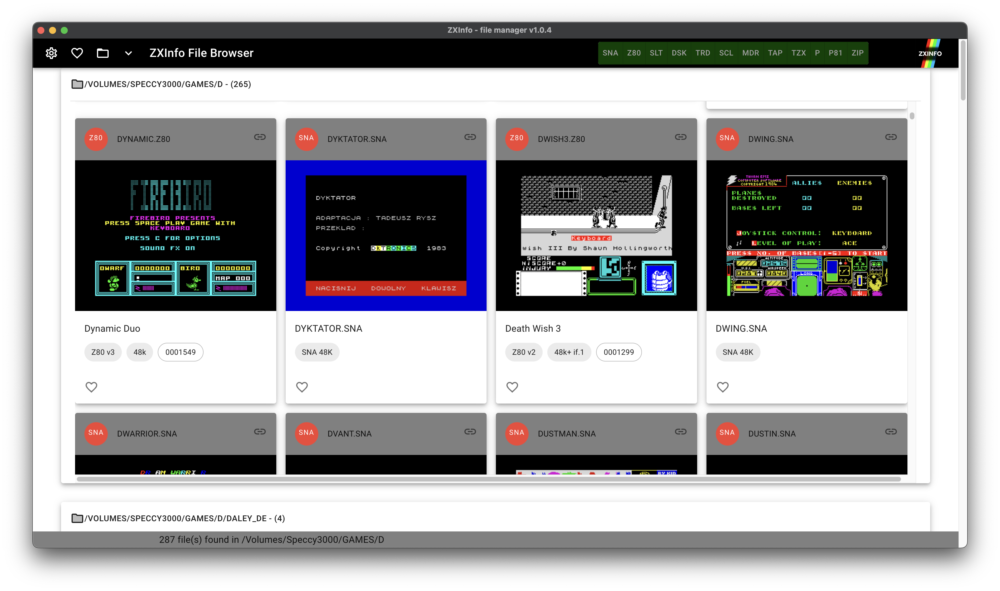

# ZXINFO File Browser
Browse your ZX Spectrum emulator files, powered by the web - kind of a "Picasa for ZX Spectrum emulator files" :-)



# Download
Download latest build for macOS, Windows and Linx on [release page](https://github.com/thomasheckmann/zxinfo-file-browser/releases)
Please note all builds are unsiged, so you might need to give persmisson to run - depending on what OS you are running.

* zxinfo-file-browser-Vnn-arm64.dmg - macOS on M1
* zxinfo-file-browser-Vnn.dmg - macOS on Intel
* zxinfo-file-browser-Vnn.exe - Windows
* zxinfo-file-browser-Vnn.AppImage - Linux

# Features
* Scan files local on your harddisk
* Display files in the following formats: SNA, Z80, TAP, TZX, P, DSK, TRD, SCL, MDR
* Handles files in ZIP archives (to one level)
* Generates SCR preview and other details for various formats: SNA, Z80, TAP, TZX
* Generates DISK/MDR SCR preview showing files for DSK, TRD, SCL & MDR
* Generates ZX81 SCR preview with BASIC list for P & TZX (ZX81)
* Integrates with ZXDB via ZXInfo API, using sha512 hash on files, to lookup title and ZXDB id
* Direct link to detail page, if found in ZXDB, to ZXInfo.dk
* Ability to choose SCR preview from ZXInfo, if known
* Keep track of your favorite games with your own favorites list
* Quick access to folders

# Questions?
See the [FAQ](FAQ.md)

# Build it yourself
Requirements:
* Git client - for example [GitHub Desktop](https://desktop.github.com/)
* Install node.js - find installation [here] - (https://nodejs.org/en/download/)

## Simple - just build the app ready to run
Clone the repository and run build
```
cd <some folder>
git clone git@github.com:thomasheckmann/zxinfo-file-browser.git
cd zxinfo-file-browser
npm i
npm run build
```
The app is then available in the 'dist' folder.

# Development
See [Development.md](Development.md) for details about how to build zxinfo-file-browser.
